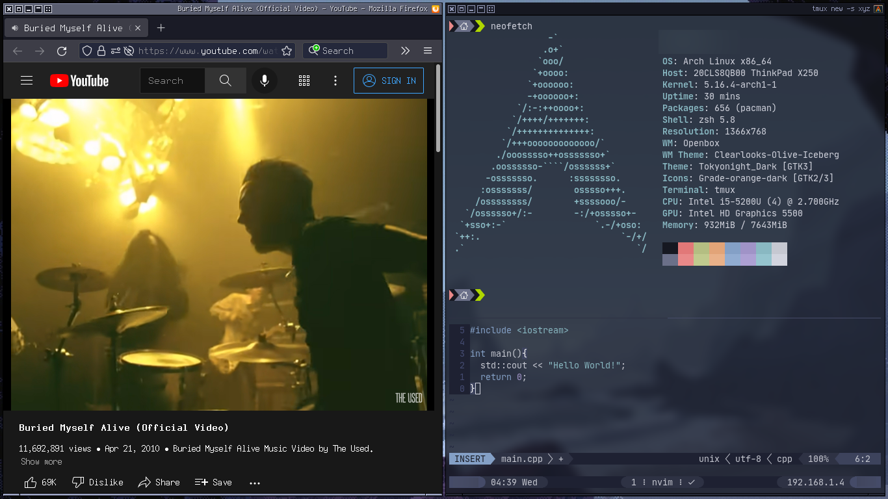

# Openbox Iceberg

Openbox rice inspired by [iceberg.vim](https://github.com/cocopon/iceberg.vim)

### Project Status

WIP

### Information

|  |  |
| ------------- | ------------- |
| **Wallpaper**  | [https://wallhaven.cc/w/j88pom](https://wallhaven.cc/w/j88pom) |
| **Openbox Theme**  | [Clearlooks-Olive-Iceberg](Clearlooks-Olive-Iceberg) |
| **Terminal**  | [Alacritty](https://github.com/alacritty/alacritty) |
| **Terminal Font**  | [JetBrains Mono Nerd Font](https://github.com/ryanoasis/nerd-fonts) |
| **Terminal Color**  | [Iceberg](https://github.com/alacritty/alacritty/wiki/Color-schemes#iceberg) |
| **Terminal Prompt**  | [Starship](https://github.com/starship/starship) |
| **Terminal Prompt Config**  | [starship.toml](https://github.com/mickimnet/myth-prompt-themes/blob/main/dark/pointed/starship/starship.toml) |
| **Neovim Theme**  | [iceberg.vim](https://github.com/cocopon/iceberg.vim) |
| **Tmux Theme**  | [iceberg.tmux.conf](https://github.com/gkeep/iceberg-dark#iceberg-dark) |
| **Compositor**  | [Picom](https://github.com/yshui/picom) |